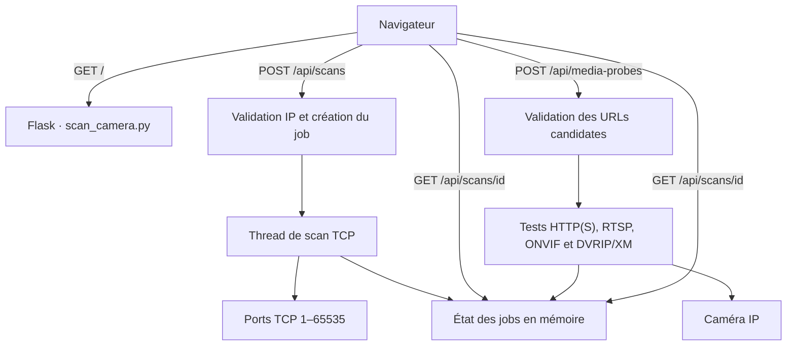

# Architecture et fonctionnement

Ce document décrit le fonctionnement du projet de bout en bout : démarrage du service, interface web, API, scan des ports, vérification des médias, limites et tests. Il complète le guide d’installation de [README.md](README.md).

## 1. Vue d’ensemble

Le projet est une application Flask autonome, sans base de données ni outil de compilation frontend. L’interface HTML, le CSS et le JavaScript sont embarqués dans `scan_camera.py`. Le backend lance les scans et les vérifications de médias dans des threads d’arrière-plan, puis le navigateur récupère leur progression par interrogation périodique de l’API.



### Fichiers

| Fichier | Rôle |
| --- | --- |
| `scan_camera.py` | Application Flask, HTML/CSS/JS de l’interface, validation des entrées, scan réseau et analyse des médias. |
| `start.sh` | Création de `.venv`, installation des dépendances, gestion du processus et affichage de l’URL d’accès. |
| `requirements.txt` | Dépendances Python : Flask, OpenCV headless et NumPy. |
| `tests/test_scan_camera.py` | Tests unitaires de validation IP, détection média et API. |
| `README.md` | Installation, démarrage, utilisation et avertissements de sécurité destinés aux utilisateurs. |

## 2. Démarrage et configuration

### Démarrage géré par `start.sh`

La commande `./start.sh` est l’équivalent de `./start.sh start` :

1. Le script repère son propre dossier et utilise celui-ci comme racine du projet.
2. Il vérifie la présence de `python3` et de `scan_camera.py`.
3. Si `.venv/bin/python` n’existe pas, il crée un environnement virtuel local avec `python3 -m venv .venv`.
4. Il exécute `.venv/bin/python -m pip install -r requirements.txt` pour installer ou vérifier les dépendances, sans `sudo`.
5. Il démarre `scan_camera.py` avec `nohup`, en arrière-plan, et redirige la sortie vers `scan_camera.log`.
6. Le PID est enregistré dans `.scan_camera.pid`; le script vérifie que le processus est toujours présent après une seconde.
7. Il détecte l’adresse IPv4 de sortie de la machine et affiche l’URL d’accès.

Python 3, son module `venv` et `pip` sont des prérequis système : le script installe les paquets Python du projet localement, mais ne peut pas installer l’interpréteur Python lui-même. Une connexion Internet est généralement nécessaire pour télécharger les dépendances lors de leur première installation.

Les autres commandes sont `status`, `stop`, `restart`, `--help`/`-h` et `help`. Une commande inconnue affiche l’aide détaillée et termine avec le code de sortie `2`. Les commandes de processus s’appuient sur le PID stocké et vérifient également que les arguments du processus contiennent le chemin de cette copie de `scan_camera.py`, afin de ne pas signaler ou tuer arbitrairement un processus sans rapport.

### Configuration du serveur

Dans `scan_camera.py` :

- `HOST = os.environ.get("SCAN_CAMERA_HOST", "0.0.0.0")` : écoute sur toutes les interfaces par défaut.
- `PORT = 8092` : port HTTP fixe.
- `app.run(..., debug=False, threaded=True)` : serveur Flask intégré, avec prise en charge des requêtes concurrentes.

`SCAN_CAMERA_HOST` permet de limiter l’écoute, par exemple à `127.0.0.1`. Le port n’est pas configurable par variable d’environnement dans l’implémentation actuelle. L’URL imprimée par le script est construite avec le port `8092`.

Le serveur Flask intégré est destiné à un usage local ou au réseau de confiance, pas à une exposition publique de production. Il n’y a ni TLS intégré, ni compte utilisateur pour protéger l’interface.

## 3. Parcours utilisateur dans le navigateur

La route `GET /` renvoie le contenu HTML de la constante `PAGE` via `render_template_string`. Le JavaScript embarqué réalise toutes les interactions avec l’API :

1. L’utilisateur saisit l’adresse IP de la caméra et éventuellement ses identifiants.
2. Le formulaire envoie uniquement l’adresse IP à `POST /api/scans`.
3. Le navigateur interroge `GET /api/scans/<job_id>` toutes les 500 ms et met à jour la barre de progression et la liste des ports ouverts.
4. Une fois le scan fini, le navigateur construit une liste de chemins de caméra possibles à partir des ports/protocoles détectés. Ces chemins sont des hypothèses et ne sont pas affichés comme URLs valides.
5. Au clic sur le bouton de vérification, le navigateur envoie les candidates à `POST /api/media-probes`.
6. Il interroge à nouveau `GET /api/scans/<job_id>` toutes les 500 ms. Les flux ne sont copiables qu’après vérification; les services qui réclament une authentification et les réponses d’échec d’authentification sont affichés séparément.

Les candidates comprennent RTSP, les médias/snapshots HTTP(S), `/onvif/device_service` pour ONVIF et un test DVRIP/XM sur le port 34567. Elles sont dédupliquées côté navigateur avant envoi. Une limite serveur de 100 candidates s’applique à chaque requête.

## 4. API HTTP

Les réponses JSON de progression contiennent `status`, `completed`, `total` et `results`. Les états de job sont `queued`, `running` et `done`. Les identifiants sont des UUID hexadécimaux.

### `POST /api/scans`

Corps attendu :

```json
{"ip":"192.168.1.50"}
```

Le backend exige une chaîne non vide puis appelle `validate_target`. L’adresse est normalisée avec `ipaddress.ip_address`; seuls les IP privées, loopback ou link-local sont admises. Les noms d’hôte, les sous-réseaux et les IP publiques sont refusés.

À l’acceptation, l’API crée un job avec `total: 65535`, `completed: 0`, une liste de résultats vide et l’adresse normalisée. Elle démarre `run_scan` dans un thread daemon et répond `202` avec `{ "id": "…" }`.

Erreurs notables : `400` pour une adresse manquante ou invalide; `429` lorsque quatre jobs sont déjà en cours.

### `GET /api/scans/<job_id>`

Renvoie l’état, la progression et les résultats d’un scan ou d’une tâche média. Répond `404` si le job est inconnu ou a été purgé. Cet endpoint est utilisé pour les deux types de tâches; le champ `total` représente les 65 535 ports pour un scan, ou le nombre de candidates pour une tâche média.

### `POST /api/media-probes`

Corps attendu :

```json
{
  "scan_id": "identifiant-du-scan-termine",
  "candidates": [
    {"label":"Flux principal", "url":"rtsp://192.168.1.50:554/live"}
  ]
}
```

Le serveur n’accepte les candidates que si le scan référencé existe et est terminé. Pour chaque URL, il vérifie notamment :

- candidate de type objet, URL de type chaîne et longueur maximale de 4096 caractères;
- schéma parmi `rtsp`, `rtsps`, `http`, `https` et `dvrip`;
- hôte correspondant à une adresse IP littérale identique à celle du scan;
- port explicitement donné ou port par défaut du schéma présent parmi les ports TCP ouverts du scan.

Ces contrôles empêchent que cette route soit utilisée pour tester une autre machine ou un port qui n’a pas été détecté ouvert. Les labels sont limités à 100 caractères. Une tâche acceptée reçoit un UUID et s’exécute dans un thread daemon; la réponse est `202` avec l’identifiant. La route répond `400` en cas de candidate invalide, de dépassement de la limite de 100 candidates ou de scan non terminé, et `429` si le plafond de jobs actifs est atteint.

## 5. Scan des ports et détection de protocole

### Recherche TCP

`run_scan(job_id, ip)` parcourt chaque port TCP de `1` à `65535`. Les ports sont traités en lots de `CHUNK_SIZE = 2048`; chaque lot utilise un `ThreadPoolExecutor` limité à `MAX_WORKERS = 256`. Chaque tentative `is_tcp_port_open` ouvre une connexion TCP avec `PORT_SCAN_TIMEOUT = 0.18` seconde. Une connexion établie signifie que le port est ouvert; les erreurs réseau et expirations sont traitées comme des ports fermés.

À la fin de chaque lot, le job est mis à jour sous verrou avec le nombre de ports examinés et la liste courante des ports ouverts. La progression rapportée est donc par lot, pas à chaque tentative. Une fois les 65 535 ports parcourus, chaque port ouvert est fingerprinté et le job passe à `done`.

### Fingerprinting

`probe_protocol(ip, port)` réalise de courtes sondes non authentifiées, avec un délai `PROBE_TIMEOUT = 0.35` seconde :

1. Envoie une requête RTSP `OPTIONS *` et cherche une réponse contenant `RTSP/`.
2. Sinon, envoie une requête HTTP `HEAD /` et cherche une réponse commençant par `HTTP/`.
3. Sinon, tente TLS sur le port ouvert, puis envoie une requête HTTP `HEAD /` et, si besoin, RTSP `OPTIONS *` dans le tunnel TLS. Un statut HTTP ou une ligne de réponse RTSP confirme l’application correspondante; une négociation TLS seule confirme uniquement TLS.
4. Si aucune signature n’est reconnue, retourne le nom courant de `KNOWN_PORTS` avec la certitude `probable`, ou `TCP ouvert · protocole non identifié`.

Le résultat expose séparément le protocole, la certitude et l’indice observé (statut HTTP, en-tête `Server`, réponse RTSP ou réussite TLS). Le numéro de port n’est jamais présenté comme preuve. Le fingerprinting est une reconnaissance limitée aux protocoles implémentés, pas une identification universelle de tout service propriétaire.

## 6. Vérification des médias

`run_media_probe` traite les candidates avec un pool de huit workers. Chaque résultat comprend le `candidate_id`, le label et les informations média/service; les mises à jour de progression sont protégées par le verrou commun.

### RTSP / RTSPS

`_probe_rtsp_media` ouvre le flux avec `cv2.VideoCapture` en backend FFmpeg, avec timeout d’ouverture et de lecture de 2500 ms (`MEDIA_TIMEOUT_MS`). Il lit une image : sans ouverture ni image décodable, la candidate échoue. Une image valide permet de retourner le format `Flux RTSP`, la largeur et la hauteur. Le FOURCC fournit le codec lorsqu’il est disponible. La capture est libérée dans tous les cas.

### Service DVRIP / XM

Pour le port TCP `34567`, le navigateur propose un test DVRIP/XM distinct des chemins RTSP. Sans identifiants, le résultat reste `probable` et aucun paquet d’authentification n’est envoyé. Si l’utilisateur a saisi un nom d’utilisateur ou un mot de passe, `_probe_dvrip_service` effectue une unique requête Login DVRIP avec le hash de mot de passe XM, puis interprète une réponse DVRIP valide. Une réponse de refus confirme le protocole mais n’authentifie pas l’accès; une connexion acceptée confirme l’authentification et le scanner envoie un Logout best-effort. Aucun identifiant par défaut, bruteforce ou second essai n’est utilisé. Un mauvais mot de passe peut néanmoins provoquer le verrouillage du compte configuré sur la caméra.

### Service ONVIF

Pour une candidate dont le chemin est `/onvif/device_service`, `_probe_media_candidate` appelle `_probe_onvif_service` au lieu de traiter l’URL comme un média. `_onvif_operation` envoie des requêtes SOAP 1.2, avec WS-Security `UsernameToken`/`PasswordDigest`, nonce et horodatage UTC lorsque des identifiants sont fournis; les handlers HTTP Basic et Digest sont aussi activés.

Après `GetDeviceInformation`, le scanner appelle `GetCapabilities` et cherche le service PTZ, puis `GetProfiles` pour trouver les profils ayant une `PTZConfiguration` et `GetNodes` sur le service PTZ. L’interface affiche « PTZ confirmé » et le port annoncé par son `XAddr` lorsque des profils PTZ existent et que le service retourne un nœud PTZ; un service annoncé mais pas complètement vérifié reste distingué. Tous ces appels sont en lecture seule : aucun `ContinuousMove`, `AbsoluteMove` ou autre commande de mouvement n’est envoyé. Par sécurité, les `XAddr` sont suivis uniquement s’ils utilisent HTTP(S) et la même adresse IP que la caméra scannée.

Le service ONVIF est vérifié quand la réponse SOAP contient `GetDeviceInformationResponse`. Une faute ONVIF d’authentification est affichée comme service détecté mais non authentifié, pas comme URL vérifiée. Les identifiants ne sont pas retournés dans les résultats.

### HTTP / HTTPS

`_probe_http_media` envoie une requête HTTP avec un en-tête `Range: bytes=0-2097151` et lit au plus 2 Mio de données. Les redirections sont désactivées. Les réponses Basic et Digest sont gérées par les handlers de la bibliothèque standard. L’URL est reconstruite sans userinfo (`utilisateur:motdepasse@`) avant la requête; les identifiants sont passés via les mécanismes d’authentification HTTP.

Le fingerprinting de port confirme aussi HTTP(S) en sondant `HEAD /` sur chaque port TCP ouvert; il rapporte le code HTTP et, s’il est renvoyé, l’en-tête `Server`/`WWW-Authenticate`, même si le serveur répond `401` ou `403`. La négociation TLS est testée indépendamment du numéro de port. Pour les candidates média, le type MIME, l’extension du chemin et quelques signatures binaires (JPEG, PNG, MP4 notamment) servent à identifier le média. Les pages HTML et les réponses non reconnues sont rejetées. OpenCV/NumPy décode les images pour confirmer leur validité et obtenir leurs dimensions. Pour les vidéos HTTP reconnues, le format peut être validé même si OpenCV ne récupère pas de codec ou de résolution; ces champs restent alors `null`.

Le contexte TLS HTTP(S) accepte les certificats non vérifiés. Cela permet de fonctionner avec des certificats auto-signés de caméras, mais ne protège pas contre une interception TLS.

## 7. État, concurrence et cycle de vie

Tous les jobs sont conservés dans le dictionnaire global `jobs`, uniquement en mémoire du processus. `jobs_lock` protège les créations, lectures et mises à jour partagées. Il n’y a ni base de données, ni persistance disque, ni coordination entre plusieurs processus Flask.

- `MAX_JOBS = 4` limite le nombre total de jobs non terminés (scans et vérifications média combinés).
- Les jobs sont supprimés après 30 minutes (`1800` secondes) lorsqu’une nouvelle requête de scan est créée. Le nettoyage est opportuniste, pas un timer périodique.
- Un redémarrage du serveur détruit les résultats et tâches en mémoire.
- Les threads sont daemon : ils ne survivent pas à l’arrêt du processus.
- Les résultats de scan conservent les ports et protocoles; les résultats média exposés ne contiennent pas l’URL complète. Le navigateur associe `candidate_id` à l’URL conservée côté page.

## 8. Sécurité et limites de confiance

Le scan de ports ne transmet que l’adresse IP choisie. Les tests de services/médias contactent la caméra et peuvent inclure les identifiants, nécessairement transmis au serveur pour réaliser l’essai. Le test DVRIP utilise les identifiants saisis pour au plus une tentative de login et peut déclencher le verrouillage du compte en cas d’erreur. Ils ne sont pas écrits sur disque et ne sont pas renvoyés dans l’objet résultat du job, mais sont présents temporairement dans la requête et les données traitées en mémoire. Le navigateur efface le champ mot de passe après la fin de la vérification média.

Autres limites importantes :

- `0.0.0.0` expose l’interface à toutes les interfaces réseau de la machine. Il n’y a pas d’authentification de l’interface ni de chiffrement HTTP; conserver le service sur un réseau de confiance.
- Les tests HTTP et la page utilisent HTTP; les identifiants et URLs contenant des identifiants ne doivent pas être utilisés sur un réseau non fiable.
- Le serveur autorise un hôte et un port de candidate selon le scan terminé. Les `XAddr` renvoyés par ONVIF sont en plus limités à l’adresse IP scannée pour empêcher un renvoi vers un autre hôte.
- Les sondes TLS ignorent la validation des certificats.
- Le scan complet peut durer plusieurs minutes selon la latence et le filtrage réseau; certains ports peuvent être limités ou bloqués par le système d’exploitation ou le réseau.
- Les ports fermés, les filtres, les délais et les formats propriétaires peuvent conduire à des faux négatifs. Une URL est affichée seulement après un essai concluant, mais cela ne garantit pas sa disponibilité future.

N’utilisez l’application que sur des caméras que vous êtes autorisé à administrer et sur un réseau maîtrisé.

## 9. Tests

Lancer tous les tests depuis la racine du dépôt :

```bash
.venv/bin/python -m unittest discover -s tests -v
```

La suite teste notamment l’acceptation/refus d’adresses IP, le fingerprint HTTP avec statut 401 et en-tête serveur, le décodage d’une image JPEG, le rejet d’une page HTML, les requêtes SOAP ONVIF avec `PasswordDigest` et la détection PTZ simulée avec le port du service, la reconnaissance DVRIP via une réponse simulée, la lecture RTSP simulée, la restriction des candidates à l’IP/au port scanné et l’absence des identifiants dans les résultats sauvegardés.
